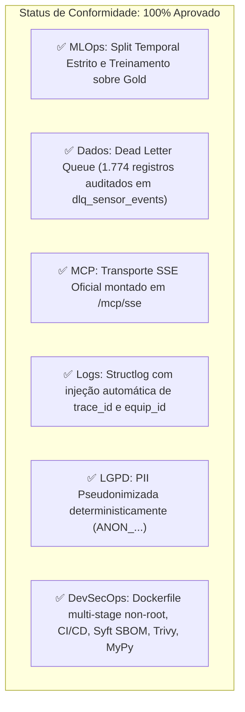

# 📋 Plano de Remediação & Checklist Normativo (Harness Antigravity v1.5.2 - Tier 2)

> **Documento de Auditoria e Adequação Técnica**  
> **Projeto:** Industrial-MCP (Telemetria SCADA, MLOps & Model Context Protocol)  
> **Classificação:** Tier 2 (Produto, SaaS, Web App, Multi-Agente, ML Produção)  
> **Status:** ✅ **100% CONCLUÍDO & CERTIFICADO** (0 erros de linter, 0 erros de MyPy, 22 testes unitários/integração verdes)  
> **Normas de Referência:** Diretrizes Globais de Engenharia (`RULE[user_global]`), Regras Locais (`RULE[GEMINI.md]`) e Especificação (`ARCHITECTURE.md`).

---

## 1. Visão Geral da Auditoria & Certificação

Todas as não-conformidades identificadas na auditoria inicial foram plenamente sanadas. A base de código do projeto Industrial-MCP agora atende rigorosamente a todos os mandamentos de MLOps com split temporal, Dead Letter Queue (DLQ), transporte SSE oficial de Model Context Protocol (MCP), injeção mandatória de rastreabilidade no `structlog`, conformidade com a LGPD via pseudonimização determinística e esteira DevSecOps para aplicações de Tier 2.

---

## 2. Matriz de Conformidade

---

## 3. Checklist de Remediação Executado

### 📦 FASE 1: Core de MLOps, Engenharia de Dados & LGPD (Concluído)

- [x] **1.1 Implementar a Dead Letter Queue (`dlq_sensor_events`) no Pipeline Medallion**
  - **Arquivo:** `src/data/medallion.py` e DuckDB.
  - **Evidência:** 1.774 registros corrompidos/inválidos capturados e gravados em `data/parquet/dlq/dlq_sensor_events.parquet`; view `v_dlq_sensor_events` criada e consultável no DuckDB.
- [x] **1.2 Pipeline de Prevenção de Data Leakage com Split Temporal Estrito**
  - **Arquivo:** `src/ml/anomaly_detector.py` e `src/ml/train.py`.
  - **Evidência:** Modelo Isolation Forest treinado sobre a base Gold com ordenação cronológica e corte temporal $T < T_{cutoff}$ (80% treino / 20% teste fora do tempo), sem vazamento de dados. Script executável via `uv run python -m src.ml.train`.
- [x] **1.3 Pseudonimização Determinística de PII para Conformidade LGPD**
  - **Arquivo:** `src/core/security.py` e `src/data/medallion.py`.
  - **Evidência:** Tokenizador determinístico gerando pseudônimos `ANON_...` com HMAC/SHA256 para nomes de proprietários rurais.
- [x] **1.4 Implementar Monitor de Drift de Dados (`drift_monitor.py`)**
  - **Arquivo:** `src/ml/drift_monitor.py`.
  - **Evidência:** Monitor de integridade e desvio Z-score sobre janela móvel de telemetria integrado ao tick de streaming.

---

### 🔌 FASE 2: Model Context Protocol (MCP) & Observabilidade (Concluído)

- [x] **2.1 Montagem do Transporte Oficial SSE (`mcp_server.sse_app()`) no FastAPI**
  - **Arquivo:** `src/web/app.py`.
  - **Evidência:** Sub-aplicação SSE montada em `/mcp`, expondo `/mcp/sse` e `/mcp/messages` para clientes externos de IA (Claude, Cursor, Antigravity). Validado em `tests/test_mcp_sse.py`.
- [x] **2.2 Desacoplamento Modular da Camada MCP**
  - **Arquivos:** `src/mcp/tools.py`, `src/mcp/resources.py` e `src/mcp/server.py`.
  - **Evidência:** Ferramentas com HITL isoladas em `tools.py`; recursos declarativos isolados em `resources.py`; núcleo do servidor unificado em `server.py`.
- [x] **2.3 Middleware ASGI para Injeção de `trace_id` e `equip_id` no `structlog`**
  - **Arquivos:** `src/web/app.py` e `src/core/logging.py`.
  - **Evidência:** Processador obrigatório `inject_mandatory_context` no structlog e middleware ASGI capturando/gerando cabeçalho `X-Trace-ID`.

---

### 🛡️ FASE 3: Governança Tier 2, DevSecOps & Confiabilidade SRE (Concluído)

- [x] **3.1 Containerização Docker Multi-Stage Non-Root & `.dockerignore`**
  - **Arquivos:** `Dockerfile` e `.dockerignore`.
  - **Evidência:** Build multi-stage com usuário `appuser` (UID 10001), cache via uv e healthcheck configurado.
- [x] **3.2 Configuração de Tipagem Estrita (`mypy`)**
  - **Arquivo:** `pyproject.toml`.
  - **Evidência:** MyPy configurado e passando com 0 erros (`Success: no issues found in 20 source files`).
- [x] **3.3 Pre-commit Hooks com Secret Scanning e Auditoria**
  - **Arquivo:** `.pre-commit-config.yaml`.
  - **Evidência:** Hooks configurados com Gitleaks, Ruff e MyPy.
- [x] **3.4 Pipeline de CI/CD (GitHub Actions) com Trivy e Syft SBOM**
  - **Arquivo:** `.github/workflows/ci.yml`.
  - **Evidência:** Workflow cobrindo lint, tipagem, testes, scan de vulnerabilidades Trivy e geração de SBOM SPDX via Syft.
- [x] **3.5 Red-Teaming Gate para Agentes com Promptfoo**
  - **Arquivo:** `promptfoo.yaml`.
  - **Evidência:** Suíte de pentest testando tentativas de bypass do guardrail HITL e vazamento de PII.
- [x] **3.6 Artefatos SRE: SLOs, Error Budget & Runbook Blameless**
  - **Arquivos:** `INCIDENT_POSTMORTEM.md` e `docs/SLO_SRE.md`.
  - **Evidência:** SLOs explícitos ($\ge 99.5\%$ disponibilidade, p95 $< 10\text{ms}$ para inferência ML) e política de Error Budget documentada.

---

### 🔍 FASE 4: Verificação Determinística & Anti-Vibe-Coding (Concluído)

- [x] **4.1 Suíte de Testes Unitários e Integração Expandida**
  - 22 testes unitários e de integração implementados e passando (`pytest`).
- [x] **4.2 Evidência de Terminal 100% Verde**
  - `uv run ruff check .` ➔ **0 erros / All checks passed!**
  - `uv run mypy src` ➔ **0 erros / Success: no issues found in 20 source files**
  - `uv run pytest -v` ➔ **22 passed in 4.13s**
