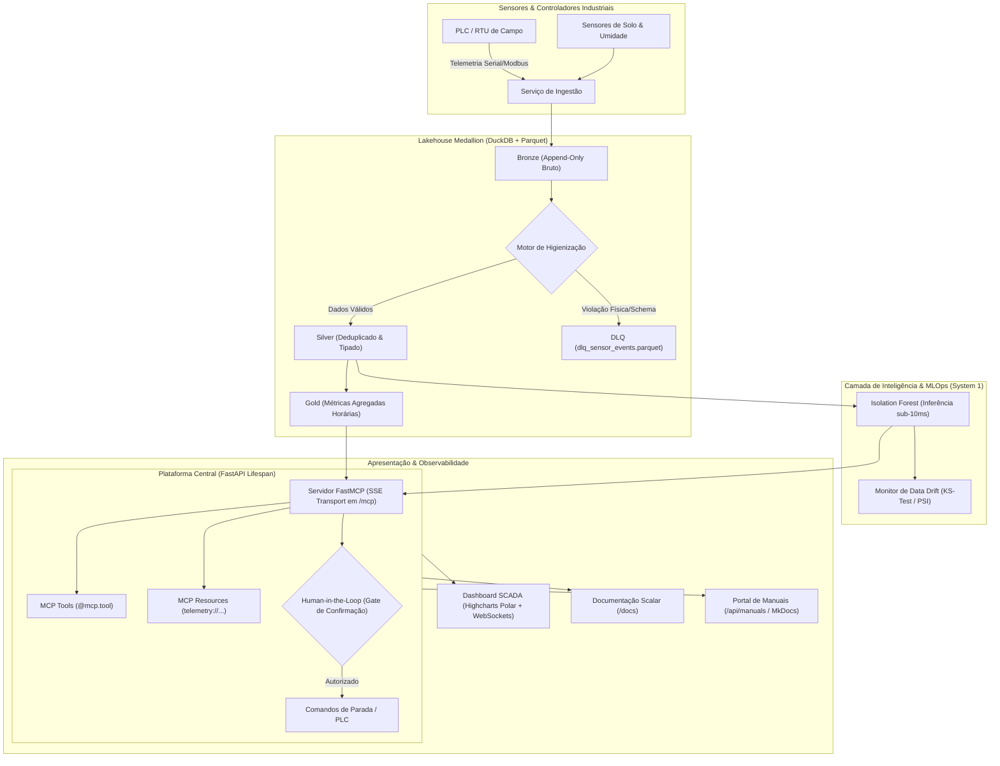

# 🛠️ Especificação Técnica do Projeto (PROJECT_SPEC.md)

> **Documento Vivo de Arquitetura & Decisões Técnicas**  
> **Status:** Ativo / Produção (Tier 2 Enterprise)  
> **Sistema:** Industrial-MCP Telemetry & Copilot  

---

## 1. Visão Geral da Arquitetura & Fluxo de Dados

O sistema opera como uma plataforma de controle industrial e IA com arquitetura desacoplada:



---

## 2. Registros de Decisão Arquitetural (ADRs)

### ADR-001: Adocão de DuckDB + Parquet Colunar em vez de RDBMS Tradicional
* **Status:** Aprovado
* **Contexto:** Séries temporais de telemetria de pivôs geram dezenas de milhares de eventos com alta densidade de leitura analítica agregada (pressão média, desvios de vibração). Um banco relacional tradicional (PostgreSQL/MySQL) adicionaria overhead de gerenciamento de containers e gargalos de I/O em janelas temporais.
* **Decisão:** Utilizar arquivos particionados `.parquet` com **DuckDB embutido em processo** (Zero-Daemon).
* **Consequência:** Latência de agregação analítica sub-15ms, custo zero de infraestrutura de banco de dados em repouso e portabilidade total dos dados.

### ADR-002: FastMCP com Transporte Server-Sent Events (SSE) Integrado ao FastAPI
* **Status:** Aprovado
* **Contexto:** Protocolos MCP baseados em `stdio` funcionam bem para ferramentas locais de desktop, mas isolam a aplicação de outros consumidores web e de observabilidade de rede.
* **Decisão:** Expor o servidor MCP via interface HTTP com transporte SSE na rota `/mcp` montada diretamente na aplicação FastAPI principal.
* **Consequência:** Suporte simultâneo para agentes de IA remotos (Antigravity, Cursor, Claude Code) e para a interface gráfica SCADA na mesma porta HTTP/8000.

### ADR-003: Cascata Two-Tier (System 1 Reflexivo vs. System 2 Deliberativo)
* **Status:** Aprovado
* **Contexto:** Enviar cada telemetria de segundo em segundo para um modelo de linguagem (LLM) geraria custos inviáveis de FinOps e latência incompatível com sistemas de controle industrial ($> 1.000\text{ms}$).
* **Decisão:** 
  * **System 1 (Reflexivo, sub-10ms, $0.00):** Isolation Forest + Regras Físicas de Domínio executadas localmente na CPU.
  * **System 2 (Deliberativo, via LLM/MCP):** Acionado sob demanda quando uma anomalia severa é detectada ou quando o operador humano solicita diagnóstico via linguagem natural.
* **Consequência:** Resposta instantânea a surtos de pressão e proteção física do equipamento, mantendo custo de nuvem mínimo.

### ADR-004: Divisão Temporal Estrita (Temporal Split) no Pipeline de MLOps
* **Status:** Aprovado
* **Contexto:** Divisões aleatórias tradicionais (`train_test_split(shuffle=True)`) geram vazamento de dados temporal (*lookahead bias*), inflando artificialmente as métricas de acurácia.
* **Decisão:** Divisão estrita por ordem cronológica (primeiros 80% do tempo para treino, últimos 20% para teste).
* **Consequência:** Avaliação realista da capacidade preditiva do modelo frente a eventos futuros não observados.

---

## 3. Contratos de Dados & Schemas Pydantic

### 3.1 Contrato de Telemetria de Entrada (`PivotTelemetry`)
```python
class PivotTelemetry(BaseModel):
    equip_id: str = Field(..., description="Identificador único do pivô ou aspersor")
    timestamp: datetime = Field(..., description="Timestamp UTC da leitura")
    pressao_bar: float = Field(..., ge=0.0, le=25.0, description="Pressão hidráulica medida na base")
    corrente_motor_a: float = Field(..., ge=0.0, le=80.0, description="Corrente elétrica dos motores dos lances")
    vibracao_mms: float = Field(..., ge=0.0, le=50.0, description="Nível de vibração na última torre")
    velocidade_angular_rads: float = Field(..., ge=0.0, le=1.5, description="Velocidade angular de rotação")
    angulo_posicao_graus: float = Field(..., ge=0.0, lt=360.0, description="Posição azimutal da torre (0-360)")
```

### 3.2 Contrato de Evento da Dead Letter Queue (DLQ)
```python
class DLQSensorEvent(BaseModel):
    raw_payload: str
    error_reason: str
    rejected_at: datetime
    sanitized_equip_id: str
```

### 3.3 Contrato de Ação de Intervenção Crítica (HITL)
```python
class EmergencyStopRequest(BaseModel):
    equip_id: str
    reason: str
    confirm: bool = Field(False, description="Exige confirmação humana explícita (Human-in-the-Loop)")
```

---

## 4. Segurança, LGPD & Pseudonimização Determinística

Para prevenir vazamento de PII (Personally Identifiable Information) em traces e logs:
1. **Hashing Salgado Determinístico:** Nomes de fazendas, proprietários e identificadores de operadores passam por SHA-256 truncado com salt fixo, gerando tokens como `ANON_B84E`.
2. **K-Anonymity em Relatórios Analíticos:** Relatórios de custo e métricas operacionais agregadas são calculados apenas para grupos com contagem amostral mínima $k \ge 5$.
