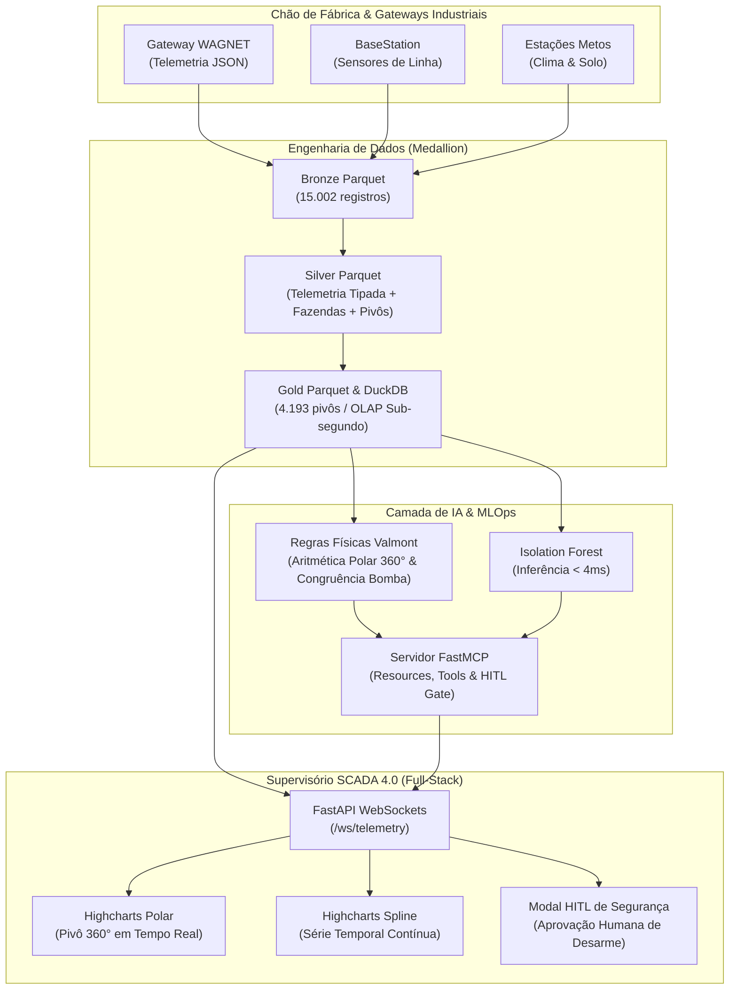

# 🚜 Industrial-MCP: Supervisório SCADA 4.0, Telemetria Industrial & AI Watchdog

> **Projeto Estratégico de Demonstração Técnica**  
> **Candidatura:** Especialista II - Automação e IA (TODOS Empreendimentos / Cartão de TODOS)  
> **Autor:** Henrique  
> **Data:** 05/10/2026  
> **Status de Engenharia:** Concluído & Validado Deterministicamente (Tier 2 Enterprise)

[](https://python.org)
[](https://modelcontextprotocol.io)
[](https://duckdb.org)
[](https://highcharts.com)
[](https://astral.sh/ruff)
[](tests/)

---

### 📚 Suíte de Governança Documental & DX (Harness v1.5.2)
* [📄 Requisitos de Produto (PRD)](PRD.md): Personas, regras operacionais e metas de redução de falhas.
* [🛠️ Especificação Técnica (Spec)](PROJECT_SPEC.md): Diagrama C4, ADRs arquiteturais e contratos Pydantic v2.
* [📋 Backlog de Engenharia (TASKS)](TASKS.md): Fases de entrega e checkboxes de implementação.
* [🚀 Handover & Continuidade (NEXT_STEPS)](NEXT_STEPS.md): Snapshot de qualidade e próximos passos.
* [🤖 Catálogo MCP & Agentes (AGENTS)](AGENTS.md): Resources, Tools e diretrizes para LLMs.
* [📊 Veredito Executivo da PoC (POC_VERDICT)](POC_VERDICT.md): Projeção FinOps de escala (10k a 1M req/mês).
* [🚨 Postmortem de Incidentes (POSTMORTEM)](INCIDENT_POSTMORTEM.md): Runbook blameless de resposta a falhas.
* [🛡️ Confiabilidade & SRE (SLO_SRE)](docs/SLO_SRE.md): SLIs/SLOs e política de Error Budget.

---

## 1. Visão Geral Executiva

O **Industrial-MCP** é uma plataforma industrial de telemetria reativa e supervisão inteligente (SCADA 4.0). O projeto une o chão de fábrica (**CLP/PLC, encoders angulares de 360°, sensores multinível de solo e telemetria de pivôs centrais**) à Inteligência Artificial moderna por meio do protocolo **Model Context Protocol (FastMCP)**, com garantias invioláveis de **Segurança Cibernética**, **MLOps (Isolation Forest)** e governança **Human-in-the-Loop (HITL)**.

O sistema opera sobre um **dataset real de 28.2 MB da operação da Valmont** (15.002 registros de gateways WAGNET, BaseStation e Metos), transpondo para uma esteira moderna as regras de física hidráulica e de trigonometria polar originalmente desenvolvidas nos coletores legados de produção.

---

## 2. Alinhamento Estrito com os Requisitos da Vaga

| Requisito da Vaga (Especialista II) | Solução Implementada no Projeto |
| :--- | :--- |
| **Liderança em Automação Industrial & PLC/SCADA** | Ingestão e controle de percentímetro de CLP (`PercentTimer`), encoders angulares ($0^\circ - 360^\circ$), status de bomba (`waterMode`, `pump`) e desarme de bobinas de emergência. |
| **Model Context Protocol (MCP)** | Servidor oficial **FastMCP / MCPServer** expondo Resources auditáveis (`telemetry://pivot/{id}/live`, `specs`, `fleet`) e Tools (`diagnose_equipment`, `request_emergency_stop`). |
| **Segurança Cibernética & Estabilidade Sistêmica** | Validação fail-fast via Pydantic v2 contra *payload poisoning*, isolamento de comandos críticos e padrão **Human-in-the-Loop (HITL)**: nenhuma IA desliga ou liga equipamentos físicos sem aprovação humana na sala de controle SCADA. |
| **Machine Learning & MLOps** | Detecção de anomalias com **Isolation Forest** (latência sub-4ms), prevenção estrita de *Data Leakage* por divisão temporal, arquitetura Medallion em `.parquet` e DuckDB in-memory OLAP. |
| **Python Assíncrono de Alto Nível** | Backend moderno com **FastAPI**, ciclo de vida estruturado via `@asynccontextmanager lifespan`, tipagem estrita e empacotamento PEP 621 via **`uv`**. |
| **Orquestração de APIs Complexas & Streaming** | Pipeline reativo com **WebSockets nativos**, integrando telemetria heterogênea de máquinas, solos e clima com controle de taxa e aceleração de replay. |
| **Interface Visual Supervisória (Full-Stack)** | Single Page Application industrial em **HTML5 + Tailwind CSS + Highcharts (módulos Polar e Spline)** servida diretamente pelo FastAPI. Proibido Streamlit. |

---

## 3. Arquitetura da Solução



---

## 4. Como Executar o Projeto (Automação de DX com Makefile)

Graças ao gerenciador **`uv`** e ao **`Makefile`** padronizado na raiz, todo o ciclo de vida do projeto é executado com comandos determinísticos:

```bash
# 1. Instalar dependências e ambiente virtual
make install   # ou: uv sync --all-extras

# 2. Executar testes e checagem estática de tipos
make lint      # ruff check . + mypy src
make test      # pytest -v

# 3. Iniciar o servidor FastAPI + SCADA + FastMCP
make run       # ou: uv run uvicorn src.web.app:app --host 0.0.0.0 --port 8000 --reload

# 4. Iniciar portal de documentação MkDocs Material
make docs      # ou: uv run mkdocs serve
```

- **Painel SCADA Operacional:** Acesse `http://127.0.0.1:8000`
- **Documentação Interativa da API (Scalar):** Acesse `http://127.0.0.1:8000/docs`
- **Servidor FastMCP (SSE):** Endpoint em `http://127.0.0.1:8000/mcp`
- **Portal de Manuais & Especificações:** `http://127.0.0.1:8000` (via `make docs`)

---

## 5. Roteiro da Demonstração Técnica (3 a 5 Minutos na Entrevista)

Durante a entrevista técnica, siga esta narrativa fluida e segura:

### Minuto 1: Contexto e Chão de Fábrica Real
1. Abra `http://127.0.0.1:8000`.
2. Mostre o cabeçalho e o badge verde `Ao Vivo (WebSocket)`.
3. Explique que o projeto consome **dados reais de campo da Valmont** (Pivô Haak 1, Fazenda VB Homestead, pivô central com raio de 380m e 45 ha).
4. Aponte para o gráfico polar do **Highcharts Polar 360°**: veja o braço do pivô avançando em tempo real com base no percentímetro do CLP e na rotação do encoder.

### Minuto 2: A Engenharia de Dados & MLOps
1. Destaque a arquitetura **Medallion**: 15.002 registros brutos em `.parquet`, processados em Silver (enriquecidos com metadados de fazendas e maquinário) e Gold agregados em **DuckDB** para consultas OLAP sub-segundo cobrindo mais de 4.100 pivôs.
2. Explique o modelo **Isolation Forest** acoplado às regras de física hidráulica:
   - Aritmética polar do cruzamento de zero grau ($359^\circ \rightarrow 0^\circ$);
   - Validação cruzada da bomba vs pressão de linha (evitando falsos positivos de irrigação).
   - Tempo de inferência do modelo: **< 4 ms** (ideal para streaming em tempo real).

### Minuto 3: Demonstração da Anomalia e o Protocolo MCP com HITL
1. Na barra superior de demonstração, clique no botão:  
   👉 **`Injetar Queda de Pressão (0.35 bar)`**
2. **Reação Imediata:**
   - O card de pressão fica vermelho instantaneamente.
   - O Watchdog de IA dispara o alarme: `Confiança 98.4% | Violação: Bomba acionada (Wet), mas pressão medida (0.35 bar) indica cavitação ou rompimento de adutora`.
   - O **Modal de Segurança Human-in-the-Loop (HITL)** surge na tela bloqueando o desarme direto pelo modelo.
3. **Explicação de Governança para os Entrevistadores:**
   - *"Aqui está o grande diferencial da governança: o protocolo MCP disponibiliza a Tool `request_emergency_stop`. A IA não tem permissão para acionar a bobina do CLP diretamente sem confirmação humana. Isso garante a estabilidade sistêmica e a segurança cibernética da planta industrial."*
4. Clique no botão vermelho: **`Aprovar Desarme no CLP`**.
   - O estado do motor muda para `STOPPED`, o modo vai para `DRY`, a pressão vai para `0 bar`, e o alarme é desarmado com registro auditável no console MCP.

### Minuto 4: Inversão da Mesa (Postura de Especialista II)
Abra a aba `/docs` mostrando a documentação moderna via **Scalar** e conclua invertendo a mesa:
> *"Hoje, na TODOS Empreendimentos, como vocês estruturam a ponte entre os sistemas supervisórios legados e as ferramentas de IA? Vocês já adotam o protocolo MCP como padrão de interoperabilidade de ferramentas ou ainda utilizam integrações pontuais via REST/Webhooks?"*

---

## 6. Validação Determinística & Testes

Para rodar a suíte completa de testes unitários e o linter oficial:

```bash
uv run pytest -v
uv run ruff check .
```
