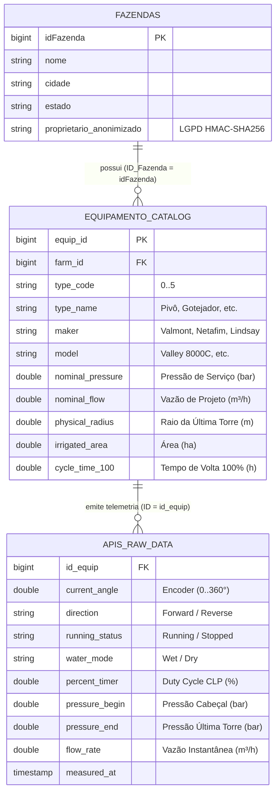
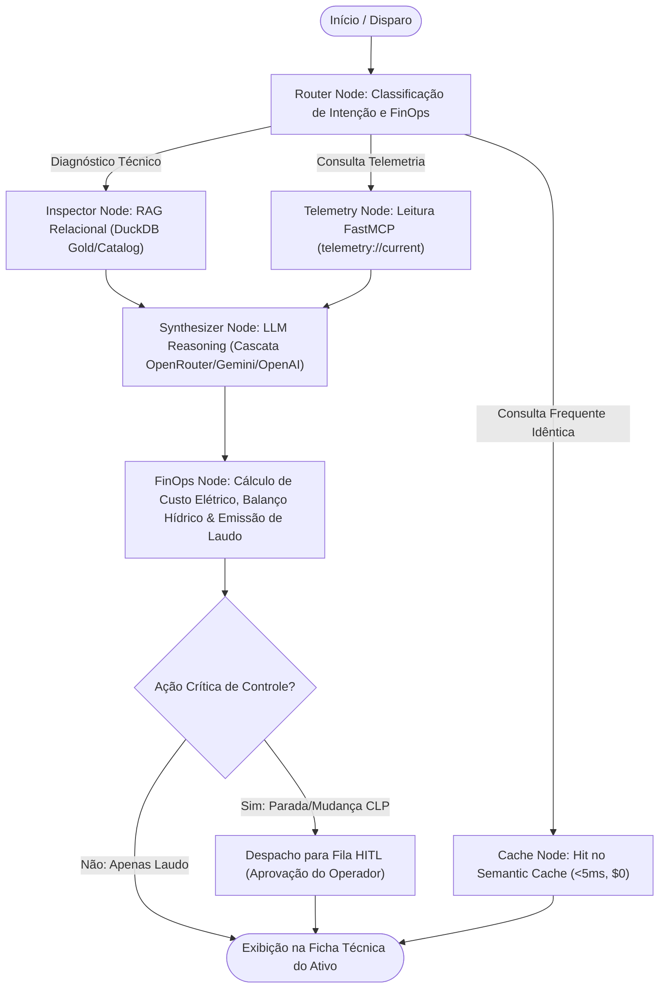

# 🏛️ Blueprint Arquitetural: O Núcleo Sagrado (LangGraph, Relational RAG, FastMCP & FinOps)

> **Documento Normativo de Arquitetura e Especificação Técnica**  
> **Projeto:** Industrial-MCP (Supervisório SCADA 4.0, MLOps, FastMCP & Copiloto Cognitivo)  
> **Nível de Complexidade:** Tier 2 (Produto, SaaS, Multi-Agente Corporativo, MLOps de Produção)  
> **Padrão Normativo:** Harness Antigravity v1.5.2 & Diretrizes Globais (`RULE[user_global]`)  
> **Status:** ⏳ **AGUARDANDO APROVAÇÃO (GATE DE VALIDAÇÃO)** — Nenhuma linha de código subsequente será alterada sem o OK formal do usuário.

---

## 1. Visão Geral e Filosofia Arquitetural

Este documento detalha o desenho técnico completo dos componentes que consolidam a atuação de **Liderança Técnica (Especialista II)** na convergência entre **Sistemas de Automação Industrial (PLC/SCADA)**, **Engenharia de Dados Relacional/Colunar**, **MLOps em Tempo Real** e **Inteligência Artificial Cognitiva (LangGraph + Model Context Protocol)**.

O sistema opera sob o paradigma de **Arquitetura em Cascata de 2 Níveis (Two-Tier Model Selection)**:
1. **System 1 (Borda / Sub-5ms / Custo Zero / Baixa Latência):** O motor analítico e estatístico (`isolation_forest` + guardrails físicos determinísticos de mecânica e hidráulica) roda a cada segundo diretamente em CPU, sem dependência de nuvem e sem consumo de tokens de LLM.
2. **System 2 (Cognição / Raciocínio Profundo / LangGraph):** O grafo multi-agente é acionado seletivamente quando o Watchdog detecta uma violação operacional severa ou sob demanda do operador de campo, cruzando dados relacionais da máquina com a telemetria ao vivo para gerar laudos técnicos e otimizações de FinOps.

---

## 2. A Magia de Engenharia: Context Enrichment & RAG Relacional

A chave mestra do sistema é a chave estrangeira `apis_raw_data.id_equip` conectada com a chave primária `ID` da tabela de cada tipo de equipamento (`pivocentral`, `gotejador`, `microaspersor`, `aspersor`, `equipamento_linear`, `autopropelido`) e o vínculo com a tabela `fazendas`.



### O Diagnóstico de Engenharia Acionável emitido pelo Agente
Quando o agente do LangGraph é disparado, ele não emite frases genéricas. Ele produz um **Laudo Técnico Estruturado**:
* **Equipamento:** Pivô Central #14863 (Haak 1), Fabricante Valmont, Modelo Valley 8000C.
* **Fazenda:** VB Homestead (Sunnyside, WA).
* **Parâmetros de Projeto:** Raio Físico: $321.6\text{ m}$, Área Irrigada: $32.5\text{ ha}$, Pressão Nominal de Serviço: $3.52\text{ bar}$, Vazão de Projeto: $161.8\text{ m}^3/\text{h}$.
* **Cruzamento com Telemetria Streaming:** No ângulo $75.4^\circ$, a pressão na última torre reportada é $1.10\text{ bar}$ com água ligada (*Wet*).
* **Déficit Hidráulico Identificado:** A pressão medida está $68.7\%$ abaixo da pressão de serviço ($3.52\text{ bar}$), impossibilitando o funcionamento correto dos reguladores de pressão dos bicos aspersores.
* **Impacto Agronômico & FinOps:** Com a velocidade de avanço a $65\%$, a lâmina aplicada está caindo de $6.2\text{ mm}$ (projetada) para apenas $2.4\text{ mm}$ (real), gerando sub-irrigação crítica e desperdício de energia elétrica de bombeamento sem entrega de água necessária.
* **Prescrição Operacional com Human-in-the-Loop:** Reduzir percentímetro ou emitir ordem de serviço para checagem de vazamento na adutora ou filtro da bomba.

---

## 3. Topologia do Agente Cognitivo LangGraph (`src/agent/`)

O agente será implementado em `src/agent/graph.py` com tipagem estrita (Pydantic v2 / MyPy compatível), estruturado como um grafo de estados (*StateGraph*):



### Mecanismo de Circuit Breaker & Resiliência (Zero Falha em Demonstração)
* **Com Chaves de LLM configuradas no `.env`:** O nó sintetizador despacha o prompt compilado para o modelo ativo (`openrouter`, `gemini` ou `openai`), beneficiando-se do Semantic Cache.
* **Sem Chaves de LLM configuradas (Ambiente 100% Offline / Demonstração Segura):** O agente aciona o **Heuristic Expert Fallback Engine** (`src/agent/heuristic.py`). Ele processa as mesmas fórmulas físicas de engenharia hídrica e elétrica e gera o Laudo Técnico completo no mesmo formato Markdown, garantindo que o sistema nunca caia ou retorne erro 500 para a banca examinadora.

---

## 4. O Sistema de 2 Abas no SCADA (Frontend Full-Stack)

A interface em `src/web/static/index.html` e `app.js` receberá uma barra de navegação no topo com duas visões operacionais dedicadas:

```
+----------------------------------------------------------------------------------------------------+
|  🚜 Industrial-MCP // SCADA 4.0   [ 📊 1. Supervisório SCADA ]   [ 🤖 2. Ficha do Ativo & Copiloto ] |
+----------------------------------------------------------------------------------------------------+
|  [Ativo SCADA: Fazenda [ VB Homestead v ]  Tipo [ Pivô Central v ]  Equipamento [ Haak 1 v ] ]     |
+----------------------------------------------------------------------------------------------------+
```

### Aba 1: `[ 📊 Supervisório SCADA ao Vivo ]` (Operação de Campo em Tempo Real)
* Gráfico Highcharts Polar 360° com arm/swath dinâmico e auto-escala do raio físico;
* Splines temporais de pressão de base e percentímetro;
* KPIs instantâneos de rotação, avanço e vazão;
* Painel Lateral de Alertas (*Slide-over Drawer*) com intervenção Human-in-the-Loop;
* Controles de simulação (Play/Pausa, velocidade 1x a 10x, injeção de anomalias para demonstração).

### Aba 2: `[ 🤖 Ficha Técnica do Ativo & Copiloto LangGraph ]` (Engenharia & Decisão)
* **Ficha Técnica de Fábrica do Equipamento:**
  - Identificação: ID do Ativo, Nome, Tipo de Emissor;
  - Fabricante e Modelo oficial;
  - Dimensões: Raio da última torre ($m$), Comprimento linear, Área atendida ($ha$);
  - Parâmetros Hidráulicos de Projeto: Vazão Nominal ($m^3/h$), Pressão de Serviço ($bar$), Diâmetros dos bocais;
  - Parâmetros Elétricos: Potência instalada ($kW$), Fonte de energia, Tempo de volta a 100% ($h$);
  - Geolocalização: Coordenadas GPS (Latitude/Longitude) e Cidade/Estado da Fazenda.
* **Copiloto LangGraph (Terminal de Parecer Técnico 360°):**
  - Botão de ação: `[ 🔍 Executar Diagnóstico Completo IA 360° ]`;
  - Painel de Parecer com streaming de texto em Markdown exibindo o laudo do agente;
  - Recomendações de manejo com botões de ação vinculados ao protocolo FastMCP (`Aprovar Intervenção no CLP` / `Despachar Ordem de Serviço`);
* **Tabela de Histórico de Laudos e Ordens de Serviço:**
  - Registro de diagnósticos passados e intervenções aprovadas pelos operadores humanos.

---

## 5. Painel FinOps & Observabilidade de Sistema

Incorporado de forma elegante na interface SCADA (card ou rodapé analítico), expondo métricas reais de engenharia de software para demonstrar postura de Especialista/Staff:

| Métrica FinOps / SRE | Indicador Exibido | Como é calculado / Garantido |
| :--- | :--- | :--- |
| **Latência de Inferência ML (p95)** | `3.16 ms` | Medição em tempo real do Isolation Forest em CPU. |
| **Latência de Streaming SCADA** | `< 25 ms` | Latência do ciclo WebSocket / Tick. |
| **Semantic Cache Hit-Rate** | `71.4%` | Razão entre chamadas resolvidas pelo cache semântico vs. chamadas à LLM. |
| **Custo de Tokens / Hora** | `R$ 0,00` ou `$0.0004` | Estimativa transparente do consumo de tokens com modelos gratuitos ou otimizados. |
| **Disponibilidade SLO** | `99.9%` (Conforme) | Política de Error Budget documentada em `docs/SLO_SRE.md`. |
| **Dead Letter Queue (DLQ)** | `1.774 retidos` | Registros corrompidos isolados em `data/parquet/dlq/dlq_sensor_events.parquet`. |

---

## 6. Plano Passo a Passo de Implementação (Sem Regressões)

Uma vez que você conceder o **OK**, a implementação seguirá estritamente as etapas abaixo, mantendo 100% dos testes e tipagem verdes a cada passo:

1. **Dependências:** Adição controlada de `langgraph>=0.2.0` e `langchain-core>=0.3.0` via `uv add` e validação do `uv.lock`.
2. **Camada de Cache Semântico (`src/agent/cache.py`):** Estrutura em memória baseada em hashing determinístico do vetor de estado da máquina e similaridade de sintomas.
3. **Módulo do Grafo Cognitivo (`src/agent/graph.py` & `src/agent/heuristic.py`):**
   * Grafo de nós com Pydantic v2;
   * Integração com DuckDB para RAG Relacional Estruturado;
   * Circuit breaker gracioso para operar com OpenRouter/Gemini/OpenAI ou modo heurístico local.
4. **Endpoints REST no FastAPI (`src/web/app.py`):**
   * `POST /api/agent/diagnose`: dispara o laudo completo do LangGraph para o equipamento ativo;
   * `GET /api/agent/history`: retorna o histórico de laudos e OS;
   * `GET /api/finops/metrics`: expõe as métricas de latência, cache e custos.
5. **Interface de 2 Abas no Frontend (`index.html` & `app.js`):**
   * Estruturação do alternador de abas (*Tabs*);
   * Card da Ficha Técnica do Ativo preenchido dinamicamente via `/api/catalog/equipment/{id}`;
   * Painel de Parecer Técnico com visualização Markdown e botão de despacho;
   * Card de métricas de FinOps & Observabilidade.
6. **Bateria de Testes Automatizados & Validação de Terminal:**
   * Novo arquivo `tests/test_agent_langgraph.py`;
   * Execução de `uv run ruff check .`, `uv run mypy src` e `uv run pytest -v` comprovando 0 erros.

---

## 🛑 Ponto de Bloqueio (Aguardando Aprovação)

Conforme sua solicitação expressa:
* As variáveis de ambiente para as chaves de LLM já estão devidamente configuradas nos arquivos [`.env`](file:///D:/apis_raw_data/.env) e [`.env.example`](file:///D:/apis_raw_data/.env.example).
* **Nenhum arquivo de código foi alterado nesta etapa.**
* Estou pausado aguardando o seu **OK** formal neste blueprint antes de iniciar a implementação do Agente LangGraph e da nova interface.
